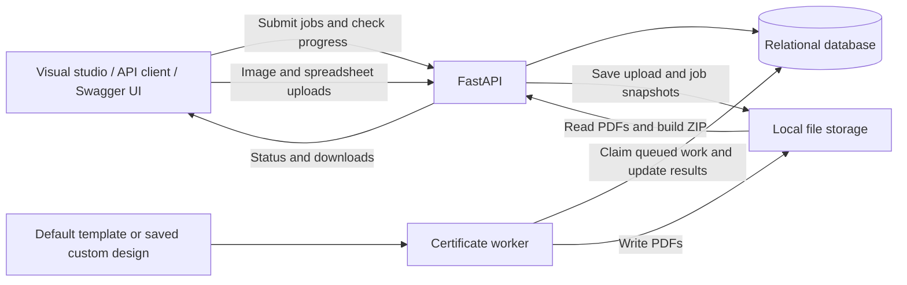
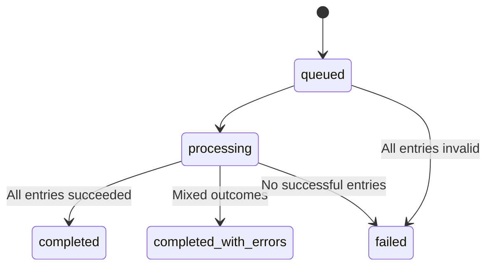

# Bulk Certificate Generator

A Python application with a visual certificate studio and a bulk-generation API. Upload a certificate design and an Excel/CSV recipient list, place text fields on the canvas, and generate personalized PDFs for the entire batch. The API accepts a batch, validates each recipient, processes certificates in the background, and exposes progress and downloads.

**Project status:** Working FastAPI backend and interactive frontend, with background processing, PDF/ZIP downloads, migrations, 14 Python tests, and 7 frontend interaction tests. The fixed-template API includes a built-in certificate design; the visual studio supports uploaded backgrounds and custom fields.

[Setup](#setup-and-execution) · [Visual builder](#visual-certificate-builder) · [Sample files](#try-the-included-sample-files) · [API](#api-design) · [Tests](#tests)

## Visual certificate builder

Open `http://127.0.0.1:8000/` with the API and worker running.

1. Upload a blank certificate background (PNG/JPEG), such as a Canva export.
2. Upload an Excel `.xlsx` or UTF-8 CSV file. The first row must contain unique column headings; the first Excel worksheet is used.
3. Select the column containing recipient names. Click any column to add it as a certificate field.
4. Drag fields into position. Select a field to change font, color, size, alignment, width, or precise coordinates. Arrow keys move a focused field; Shift increases the step.
5. Choose a preview recipient, then press **Generate certificates**. Watch individual outcomes and download PDFs or the completed ZIP.

Use **Try a ready-made example** to explore a complete example. Numbers with leading zeros should be stored as text in Excel. Formulas use cached values from the workbook; save the sheet in Excel first. Uploads are limited to 10 MB, images to 20 megapixels, expanded workbooks to 50 MB, sheets to 50 columns and the configured recipient limit. PDF backgrounds and legacy `.xls` files are not supported.

Custom fields can contain any spreadsheet column, including names, course titles, numbers, and dates. Text uses the current printable ASCII limitation. Each job stores an immutable background/layout/data snapshot under `storage/designs/{job_id}/`; editing the UI or uploading another design does not alter queued jobs. The builder adds `/builder/images`, `/builder/sheets`, and `/builder/jobs` endpoints while preserving the original fixed-template API.

The frontend uses HTML/CSS/JavaScript served by FastAPI, with local SVG icons and illustrations. The earlier Three.js module remains in the repository but is not loaded by the current layout. Its preview approximates PDF font positioning; the generated PDF is the final output. Large text shrinks to fit or fails individually if it still cannot fit. Uploads and snapshots remain on local disk until manually removed. The fixed-template API satisfies the original single-template requirement; the visual builder adds optional custom design support.

## Try the included sample files

The repository includes files from a live end-to-end check:

- [Certificate background](examples/certificate-background.png): generated dummy artwork with blank areas for personalized text.
- [Recipient Excel sheet](examples/recipients.xlsx): one generic recipient named Demo Name.
- [Generated sample PDF](examples/generated-certificate.pdf): the output for Demo Name.

Start the API and worker, upload the sample files, and select Name as the recipient column. Add Name, Course, Issue Date, and Number as text rectangles. Drag them into the blank spaces and resize their widths using the corner handles. Use Center, Left, Right, or Middle to align rectangles to the page. Pink snapping guides show matching page centers, edges, margins, and other fields. Numeric settings are optional under Advanced dimensions.

Use center alignment for all four fields. Select a recipient in the preview dropdown, then generate. Expected result: **1 successful PDF, 0 failures, 100% processed, and `completed`**. The ZIP contains one PDF and a one-entry manifest. The sample uses generic values: Demo Name, Demo Course, and DEMO-001.


## Requirements

- Submit shared certificate information and a list of recipients in one request.
- Validate recipients independently so invalid entries do not block valid ones.
- Generate one PDF per valid recipient using a single predefined template.
- Track successful, failed, pending, and processing entries.
- Retrieve individual certificates and a ZIP of successful results.
- Recover unfinished work after a worker restart.
- Test creation, validation, generation, progress, individual failures, and downloads.

## Technology choices

| Technology | Purpose |
| --- | --- |
| Python and FastAPI | API, validation, and interactive OpenAPI documentation |
| SQLAlchemy | Relational persistence |
| SQLite | Local database and durable job queue for the initial single-worker implementation |
| Alembic | Database migrations |
| ReportLab | PDF rendering |
| pytest and HTTPX | Service and API tests |
| Local filesystem | Template assets, uploaded data/design snapshots, and generated PDFs |
| HTML/CSS/JavaScript and SVG | Interactive studio, icons, and certificate illustration |
| openpyxl and Pillow | Spreadsheet reading and image validation |
| Node.js and jsdom (development only) | Frontend interaction tests and Three.js vendoring |

PostgreSQL is a future option for higher concurrency. Multiple workers would also require changes to queue claiming and coordination.

## Architecture



The API and worker run as separate processes and share the database and storage directory. The database is the source of truth for job state; files contain the generated artifacts.

### Request lifecycle

1. Validate the request structure and shared certificate information.
2. Validate every recipient independently.
3. Save the job and all recipient outcomes in one transaction. Invalid entries are recorded as failed; valid entries are pending.
4. Return the job ID after the transaction commits.
5. The worker selects the oldest queued job and processes its pending recipients sequentially.
6. Each successful PDF is saved and its item record is updated. An individual failure is recorded and processing continues.
7. The client polls progress and downloads available certificates.
8. Once every item is terminal, the job receives its final status.

## Certificate template

The initial renderer uses a high-resolution PNG background with dynamic text drawn over it into a PDF. This supports designs prepared in Canva without requiring a Canva API integration.

### Preparing a Canva design

1. Create a landscape A4 certificate (297 × 210 mm).
2. Include static artwork, logos, borders, signatures, and fixed wording.
3. Leave blank spaces for the recipient name, course/event name, issue date, and certificate ID.
4. Export a high-resolution PNG. For A4 at approximately 300 DPI, use about 3508 × 2480 pixels.
5. Upload the background in the studio and position spreadsheet fields, or save it as `app/templates/default/background.png` for the fixed-template API.
6. Generate and visually inspect a sample PDF to calibrate placement.

The exported image contains no placeholder text in the dynamic areas. The backend fills those areas for every recipient.

```text
app/templates/default/
├── layout.json       # Included fixed field positions
└── background.png    # Optional Canva export; otherwise a vector design is drawn
```

Example layout configuration (positions are illustrative):

```json
{
  "version": "1",
  "page": { "width_mm": 297, "height_mm": 210 },
  "fields": {
    "recipient_name": {
      "x_mm": 148.5,
      "y_mm": 94,
      "max_width_mm": 225,
      "font": "Helvetica-Bold",
      "font_size_pt": 32,
      "min_font_size_pt": 18,
      "align": "center",
      "color": "#203040"
    },
    "course_name": {
      "x_mm": 148.5,
      "y_mm": 124,
      "max_width_mm": 220,
      "font": "Helvetica",
      "font_size_pt": 22,
      "min_font_size_pt": 14,
      "align": "center",
      "color": "#203040"
    }
  }
}
```

Coordinates are measured from the top-left corner in millimetres; `y_mm` is the text baseline. The renderer converts these to PDF coordinates. Date and certificate ID fields follow the same configuration structure.

Text is measured before drawing. Long text shrinks to the configured minimum font size; text that still cannot fit produces a clear item failure. Names retain their spelling and capitalization after trimming surrounding whitespace.

The default design uses standard PDF Helvetica fonts and accepts printable ASCII names and course titles. Unsupported characters are rejected. Custom fonts must have appropriate redistribution rights and require renderer changes. Scripts requiring complex text shaping need additional renderer support.

Jobs record their template version. Keep fixed-template assets unchanged while queued jobs depend on them. Custom jobs copy their background and layout into an immutable job snapshot. The original `/jobs` endpoint uses this fixed template. The visual builder additionally supports uploaded backgrounds and per-job field layouts.

## API design

Base URL for local development: `http://127.0.0.1:8000`.

### Create a job

`POST /jobs`

```json
{
  "course_name": "Introduction to Python",
  "issue_date": "2026-10-06",
  "recipients": [
    {
      "reference": "participant-001",
      "name": "Demo Name",
      "email": "demo@example.com"
    }
  ]
}
```

`reference` is optional client metadata for matching results to input. Email is optional metadata; this application does not send email or print it on certificates.

For a batch containing valid recipients, return `202 Accepted` with a `Location` header pointing to the status endpoint:

```json
{
  "job_id": "6c014a7e-13e1-4f50-952e-7ae61c948a8b",
  "status": "queued",
  "total": 2,
  "accepted": 2,
  "rejected": 0,
  "status_url": "/jobs/6c014a7e-13e1-4f50-952e-7ae61c948a8b"
}
```

For `/jobs`, if every recipient is invalid, save their outcomes and return `201 Created` with the job already `failed`. No rendering work is queued.

Example submission:

```bash
curl -X POST http://127.0.0.1:8000/jobs \
  -H "Content-Type: application/json" \
  --data-binary @request.json
```

On Windows PowerShell, use `curl.exe` for this command. Save the example JSON as `request.json` first.

### Create a custom design job

The visual studio performs this workflow automatically. API clients can use the same endpoints:

| Endpoint | Input | Result |
| --- | --- | --- |
| `POST /builder/images` | Multipart `file`: PNG/JPEG | `image_id`, pixel dimensions, and preview URL |
| `GET /builder/images/{image_id}` | Uploaded image UUID | Normalized PNG background |
| `POST /builder/sheets` | Multipart `file`: XLSX/CSV | `sheet_id`, columns, first ten rows, and total row count |
| `POST /builder/jobs` | Uploaded IDs, name column, page size, and field definitions | Job ID and accepted/rejected counts |

Upload example (Bash):

```bash
curl -F "file=@examples/certificate-background.png" http://127.0.0.1:8000/builder/images
curl -F "file=@examples/recipients.xlsx" http://127.0.0.1:8000/builder/sheets
```

On PowerShell, use `curl.exe`. Substitute the returned UUIDs in this request:

```json
{
  "image_id": "RETURNED_IMAGE_UUID",
  "sheet_id": "RETURNED_SHEET_UUID",
  "name_column": "Name",
  "title": "Course completion certificates",
  "width_mm": 297,
  "height_mm": 210,
  "fields": [
    {
      "column": "Name",
      "x_mm": 148.5,
      "y_mm": 95,
      "max_width_mm": 235,
      "font": "Times-Bold",
      "font_size_pt": 34,
      "min_font_size_pt": 18,
      "align": "center",
      "color": "#122b47"
    }
  ]
}
```

Builder jobs return `202 Accepted`, including an all-invalid batch whose recorded status is already `failed`. Mapped columns must exist and text boxes must fit within page bounds. Designs support up to 30 fields, page dimensions between 50 and 420 mm, and these fonts: `Helvetica`, `Helvetica-Bold`, `Times-Roman`, `Times-Bold`, and `Courier`.

Uploaded sheet rows and mapped text are saved in the job snapshot. An email column in a spreadsheet is an ordinary column; it is not validated as contact information or used for delivery. Use the shared status, result, PDF, and ZIP endpoints below for builder jobs.

### Check progress

`GET /jobs/{job_id}`

```json
{
  "job_id": "6c014a7e-13e1-4f50-952e-7ae61c948a8b",
  "status": "processing",
  "course_name": "Introduction to Python",
  "issue_date": "2026-10-06",
  "total": 100,
  "counts": { "pending": 28, "processing": 1, "succeeded": 68, "failed": 3 },
  "processed": 71,
  "progress_percent": 71.0,
  "created_at": "2026-10-06T08:00:00Z",
  "started_at": "2026-10-06T08:00:02Z",
  "completed_at": null
}
```

`processed = succeeded + failed`. Failed entries count toward progress because no work remains for them. Counts are derived from item rows to avoid mutable counters drifting after interruptions. Operational timestamps use UTC; the printed issue date is a date without a timezone.

### List recipient results

`GET /jobs/{job_id}/recipients?limit=100&offset=0`

An optional `status` filter supports requests such as `?status=failed`. Pagination uses a bounded limit and stable input-index ordering.

```json
{
  "items": [
    {
      "index": 0,
      "reference": "participant-001",
      "name": "Demo Name",
      "status": "succeeded",
      "certificate_id": "9bf22138-2c50-48f4-b449-af1e165b9a61",
      "download_url": "/jobs/6c014a7e-13e1-4f50-952e-7ae61c948a8b/certificates/9bf22138-2c50-48f4-b449-af1e165b9a61",
      "error": null
    },
    {
      "index": 1,
      "reference": "participant-002",
      "name": "",
      "status": "failed",
      "certificate_id": null,
      "download_url": null,
      "error": {
        "stage": "validation",
        "code": "INVALID_RECIPIENT",
        "message": "name: String should have at least 1 character"
      }
    }
  ],
  "total": 2,
  "limit": 100,
  "offset": 0
}
```

### Retrieve certificates

| Endpoint | Result |
| --- | --- |
| `GET /jobs/{job_id}/certificates/{certificate_id}` | Download one successful PDF as soon as it is available |
| `GET /jobs/{job_id}/download` | Download successful PDFs as a ZIP once the job is terminal |

The ZIP includes a `manifest.json` mapping input entries to success or failure. It is built on demand in a temporary file, avoiding loading the entire batch into memory. Temporary archives are removed after the response. A process crash can leave temporary archives in the operating system temporary directory; these may require manual cleanup.

Example downloads:

```bash
curl -o certificate.pdf http://127.0.0.1:8000/jobs/JOB_ID/certificates/CERTIFICATE_ID
curl -o certificates.zip http://127.0.0.1:8000/jobs/JOB_ID/download
```

### HTTP errors

| Status | Meaning |
| --- | --- |
| `404` | Unknown job or certificate, including a certificate belonging to another job |
| `409` | Output is not ready, ZIP job is still running, or a terminal job has no successful outputs |
| `422` | Invalid request-level data or query parameters |

## Validation policy

Request-level errors reject the batch: malformed JSON, invalid shared fields, or a missing, empty, non-list, or oversized recipients list. The initial maximum is configurable, with a default of 1,000 entries.

Recipient-level errors are recorded independently: a non-object entry, missing or blank name, excessive field length, invalid optional email, or unsupported characters. The outer request is validated first, then entries are validated individually so nested validation does not reject the whole batch.

Name and course fields allow up to 150 characters; references allow up to 100. Limits appear in schemas and OpenAPI documentation. Duplicate names or emails are allowed: every input position represents a separate certificate request. Repeating a POST creates a new job; request idempotency is outside the initial scope.

## Data model

### `generation_jobs`

| Column | Purpose |
| --- | --- |
| `id` | UUID primary key |
| `course_name`, `issue_date` | Shared certificate information |
| `template_version` | Immutable template version used |
| `status` | Overall lifecycle state |
| `total_count` | Submitted entry count |
| `created_at`, `started_at`, `completed_at` | Lifecycle timestamps |

### `certificate_items`

| Column | Purpose |
| --- | --- |
| `id`, `job_id` | UUID primary key and job foreign key |
| `input_index` | Original list position |
| `client_reference` | Optional caller identifier |
| `recipient_name`, `email` | Validated values when available |
| `status` | Pending, processing, succeeded, or failed |
| `certificate_id` | Stable public UUID assigned to valid entries |
| `output_key` | Relative PDF storage location |
| `error_stage`, `error_code`, `error_message` | Safe failure details |
| `attempt_count` | Processing attempts |
| `started_at`, `completed_at` | Item lifecycle timestamps |

The schema enforces uniqueness for `(job_id, input_index)` and non-null certificate IDs. Queue and item queries are indexed. SQLite connections enable foreign keys, a five-second busy timeout, and WAL mode; rendering runs outside short database transactions.

## Status model



Valid items follow `pending → processing → succeeded` or `pending → processing → failed`. Invalid items are immediately `failed`.

A job becomes terminal when all items are terminal. All successes produce `completed`; mixed success and failure produce `completed_with_errors`; zero successes produce `failed`.

## Worker and recovery

The initial deployment supports one worker, enforced through an exclusive process lock. It polls the database, selects jobs in creation order, and renders recipients sequentially. A large job can delay subsequent jobs; this is a documented tradeoff of the simple queue.

For each item:

1. Mark it processing and increment its attempt count in a short transaction.
2. Render outside the database transaction.
3. Write a temporary PDF in the same directory as the final output.
4. Atomically replace the final path with the completed file.
5. Commit the successful item state and output key.
6. On an individual exception, record failure and continue.

Storage paths use generated IDs, never recipient names:

```text
storage/certificates/{job_id}/{certificate_id}.pdf
```

On startup, after acquiring the worker lock, reset interrupted processing items to pending, resume unfinished jobs, skip successful items, and reconcile jobs whose items are already terminal. A bounded attempt limit prevents repeated process interruptions from blocking the queue indefinitely.

If a crash occurs after saving a PDF but before committing success, recovery can render again to the same stable path. This provides at-least-once processing with repeatable output placement. The database and filesystem do not share a transaction.

Missing template assets or fonts fail startup clearly. A database outage stops processing because results cannot be recorded reliably. Detailed exceptions are logged with job/item IDs; API errors omit internal tracebacks. Storage and rendering failures remain isolated to individual entries whenever the database is available.

## Code organization

```text
app/
├── main.py                  # Fixed-template jobs, status, results, downloads
├── builder.py               # Upload parsing, design validation, custom jobs
├── config.py                # Environment settings
├── database.py              # Models and database connection
├── schemas.py               # Fixed-template request validation
├── renderer.py              # Background and text PDF rendering
├── worker.py                # Processing, failure isolation, recovery
├── static/
│   ├── index.html
│   ├── style.css
│   ├── studio.js            # Editor and batch workflow
│   ├── scene.js             # Three.js decoration and motion lifecycle
│   └── vendor/              # Three.js modules and license
└── templates/default/layout.json
migrations/
├── env.py
└── versions/0001_initial.py
examples/                    # Dummy inputs and generated sample
scripts/vendor-three.mjs
tests/
├── test_application.py
├── test_builder.py
└── ui.test.mjs
alembic.ini
package.json
package-lock.json
pyproject.toml
request.json
.env.example
README.md
```

The renderer has no FastAPI dependency and can be tested directly. Routes live in `main.py` and `builder.py`; the worker coordinates persistence, rendering, and file writes.

## Setup and execution

Requires Python 3.11 or newer. Run all commands from the repository root.

```bash
git clone https://github.com/Prathmesh333/BulkCertificateGenerator.git
cd BulkCertificateGenerator
python -m venv .venv
```

Activate the environment:

```powershell
# Windows PowerShell
.venv\Scripts\Activate.ps1
```

```bash
# macOS / Linux
source .venv/bin/activate
```

Install dependencies and run migrations. `.env.example` lists configuration options; set them as environment variables in both terminals. The app does not automatically load `.env`:

```bash
python -m pip install -e ".[dev]"
python -m alembic upgrade head
```

Configuration defaults:

```dotenv
DATABASE_URL=sqlite:///./storage/certificates.db
STORAGE_DIR=./storage
TEMPLATE_DIR=./app/templates/default
WORKER_POLL_INTERVAL_SECONDS=1
MAX_RECIPIENTS_PER_JOB=1000
MAX_PROCESSING_ATTEMPTS=3
```

Start the API and worker in separate terminals from the repository root:

```bash
python -m uvicorn app.main:app --reload
```

```bash
python -m app.worker
```

The visual studio is available at `http://127.0.0.1:8000/`. No Node process or frontend build is required for normal use.

Interactive API documentation is available at `http://127.0.0.1:8000/docs`. Both processes must use the same configuration and persistent storage.

## Tests

Run the backend tests (14 tests):

```bash
python -m pytest
```

Tests use isolated temporary databases and storage directories.

Run frontend DOM interaction tests (7 tests; Node.js 20 or newer recommended):

```bash
npm ci
npm test
```

These exercise upload state, field placement, keyboard movement, layer selection, color edits, undo/redo, zoom, recipient previews, and submission/results. They simulate the DOM and do not verify actual browser rendering or WebGL.

| Area | Coverage |
| --- | --- |
| Job creation | Persisted job/items and accepted response |
| Input validation | Shared fields, batch limits, mixed entries, and all-invalid batches |
| Certificate generation | Parseable PDF, page dimensions, expected recipient text, and text-fit behavior |
| Progress | Accurate counts and final status for every outcome combination |
| Individual failure | Injected rendering exception does not stop later recipients |
| Downloads | PDF content/headers, unavailable outputs, and job association |
| ZIP | Successful files only and accurate manifest |
| Recovery | Interrupted entries resume; successful entries are skipped; attempt limits apply |

Worker tests invoke one processing iteration directly rather than relying on polling sleeps. A generated sample is also inspected visually because PDF text extraction cannot verify alignment and appearance.

## Deployment scope and future improvements

The initial application runs on one machine with persistent local storage and one worker. Downloads are unauthenticated in the local demonstration; UUIDs identify resources and do not establish ownership. A shared deployment needs authentication and ownership checks before exposing participant data.

Generated files remain available until manually removed; automatic retention is not part of the initial scope. Email delivery, certificate verification pages, cancellation, and cloud storage are optional future extensions.

For larger deployments, consider PostgreSQL, coordinated workers or a dedicated task queue, object storage, request idempotency, retention policies, and authenticated access. These should follow completion of the required workflow.

## Development approach

1. Database schema, migrations, validation, and API contract.
2. Fixed template assets and PDF renderer.
3. Worker, failure isolation, and recovery.
4. Progress endpoints and PDF/ZIP downloads.
5. Automated tests, visual sample review, and updated runnable documentation.

## Implementation notes

The API and worker create missing tables on first startup for convenient local use. Run Alembic on a fresh database before starting either process to establish migration history. If you previously created tables through startup, use `python -m alembic stamp head` only after confirming the schema matches the current initial migration. Future schema changes should use migrations.

The worker lock lives in `STORAGE_DIR`; all workers using the same database must also share that directory. Rendering is sequential, and an ordinary item exception is terminal rather than automatically retried. The attempt limit handles work interrupted by process crashes.

Place an optional `background.png` in `app/templates/default/` and adjust `layout.json` to use your Canva design. Without it, the renderer draws the built-in border and static wording. Only the configured dynamic text is drawn over an image background. Template version changes are detected at generation time; retain the current version while jobs are pending.

## Verification

The implementation passes **17 Python tests and 8 frontend DOM interaction tests**. JavaScript syntax and locally served Three.js assets were also checked.

On 6 October 2026, the included dummy background and Excel file were submitted to the running localhost API and processed by a separate worker:

| Check | Result |
| --- | --- |
| Image and XLSX upload | Accepted and parsed |
| Leading-zero identifiers | `00001` preserved through Excel import and PDF output |
| Custom mappings | Name, course, issue date, and number present in every successful PDF |
| Individual validation failure | Blank name rejected; five other recipients succeeded |
| Progress | Monotonic progress ending at 100% |
| Final status | `completed_with_errors`, 5 succeeded, 1 failed |
| PDF downloads | Five parseable single-page PDFs with the uploaded background |
| ZIP | Five PDFs and a six-entry manifest |
| Download association | Certificate requested under another job returned 404 |
| Visual output | Normal and long-name certificate PDFs inspected; text fit and placement checked |

The historical six-row check above verified failure isolation. The files in `examples/` now contain only one generic Demo Name sample, which was also checked through the live API. The generated background is illustrative AI-created dummy artwork, not an organization-issued certificate. PyMuPDF was used locally to inspect output and is not an application dependency.

Browser responsiveness, real touch gestures, and GPU rendering remain unverified: browser automation was blocked by the tool URL policy. The current Python dependency combination emits a Starlette TestClient deprecation warning; the tests still pass.

## Studio design and motion

The studio follows the generated visual concept with a light lavender workspace, white editing panels, violet actions, locally hosted DM Sans typography, consistent SVG icons, and a certificate-stack SVG illustration. A floating formatting toolbar appears only while a text box is selected. A single stylesheet defines the responsive layout, control sizes, and accessible interaction states. The editor includes layer selection, color presets, alignment guides, zoom, undo/redo, file-drop feedback, and a one-time batch-completion celebration.

Decorative CSS motion respects **Pause motion** and system reduced-motion preferences. The current layout uses a lightweight SVG illustration and does not start a WebGL rendering loop.

Three.js 0.180.0 and its MIT license are checked into `app/static/vendor/`, so no CDN or Node process is needed to run the app. To update/rebuild frontend dependencies or run interaction tests:

```bash
npm ci
npm run vendor
npm test
```

The frontend has eight DOM interaction tests covering field placement, editing, undo/redo, zoom, keyboard movement, preview selection, and batch submission/results. These complement the 17 Python tests. JavaScript syntax checks and served assets were verified. Visual responsiveness and real touch behavior have not been verified in a browser because browser automation was blocked by the tool URL policy.

The professional studio redesign follows the [premium-frontend-ui skill](https://github.com/github/awesome-copilot/blob/main/skills/premium-frontend-ui/SKILL.md), adapted to a working editor. DM Sans is included locally with its SIL Open Font License under `app/static/fonts/`. Upload controls remain keyboard accessible; numeric settings are optional, and text alignment preserves rectangle position.

## Vercel deployment (serverless demo)

The repository includes a Vercel configuration for the existing Python API and studio. Use **Vercel + Neon PostgreSQL + Cloudflare R2**. This is designed to fit small demo workloads within provider free allowances; it does not guarantee unlimited free use. R2 activation may require billing details. No Railway service is needed.

1. Create a Neon database and copy its PostgreSQL connection URL. Use `postgresql+psycopg://` as the scheme and retain SSL parameters.
2. Create a **private** R2 bucket and an R2 S3 API token scoped to that bucket with object read/write access. Copy its endpoint and access keys. Do not make the bucket public.
3. Import this GitHub repository into Vercel. Select the **FastAPI** framework preset and the repository root. Leave the build command at its framework default. `requirements.txt` installs the application with its cloud dependencies; `vercel.json` identifies `app/main.py` and sets a 300-second maximum invocation.
4. Set every variable shown in `.env.vercel.example` in Vercel's environment settings, using real connection credentials. Do not commit credentials. `AWS_DEFAULT_REGION=auto` is for R2; another S3 provider may need a different region.
5. Deploy, open `/runtime`, and confirm `processing_mode` is `serverless`. Upload the generic sample files, place fields, and generate. Verify progress, individual PDF downloads, and ZIP download. Repeat after a redeploy to verify remote persistence.

The API initializes its existing tables on startup for a fresh database. Local development still uses SQLite, disk storage, and `python -m app.worker`. Do not run the continuous worker against the serverless database.

### Processing and persistence

In serverless mode the studio calls `POST /jobs/{job_id}/process` before each progress refresh. Each request renders at most 10 recipients and starts no new recipient after 120 seconds. PDFs still render in Python. PostgreSQL stores statuses; R2 stores uploads, immutable design snapshots, PDFs, and ZIP archives. Local `/tmp` files are working copies, not durable storage. A per-job PostgreSQL transaction advisory lock prevents overlapping invocations from processing the same job, including with a pooled database URL. Interrupted items are retried on the next invocation, with the existing attempt limit. Completed recipients are not regenerated.

**The tab drives processing.** Closing it stops further batch requests; reopening the studio resumes the saved job in that browser. API clients must call the process endpoint repeatedly until the status is terminal. This is a resumable demo workflow, not an independently scheduled queue. A single rendering/storage operation can still hit the platform timeout; its next invocation recovers the interrupted item.

Uploads are capped at **3,000,000 bytes per file** in the deployment example to leave room below Vercel's request-body limit. This version deliberately rejects larger uploads; it does not implement direct-to-storage uploads. The example caps jobs at 100 recipients. PDFs and ZIPs download using private 10-minute signed object URLs, avoiding function response-size limits. ZIP creation is still bounded by function runtime; reduce job size if it times out. All jobs are accessible by their UUID URLs: there is no user authentication. Keep the interview deployment protected with Vercel deployment access controls, and set bucket lifecycle expiration and provider usage limits before sharing widely. Uploads and outputs are not automatically deleted by the application.

Cloud integration requires live credentials and a deployment smoke test. Unit tests exercise bounded processing, job isolation, persistence through an empty local cache, and configuration validation; they do not prove live PostgreSQL locking or R2/Vercel interoperability.

References: [Vercel FastAPI deployment](https://vercel.com/docs/frameworks/backend/fastapi), [Vercel function limits](https://vercel.com/docs/functions/limitations).
